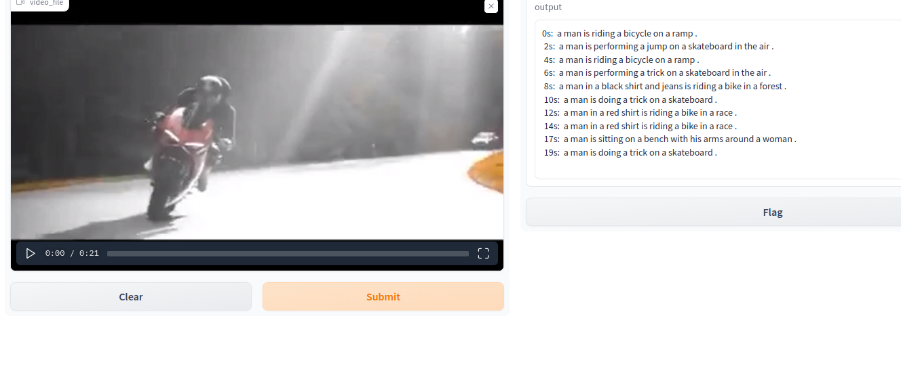
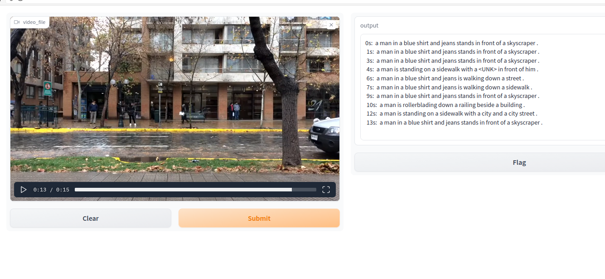
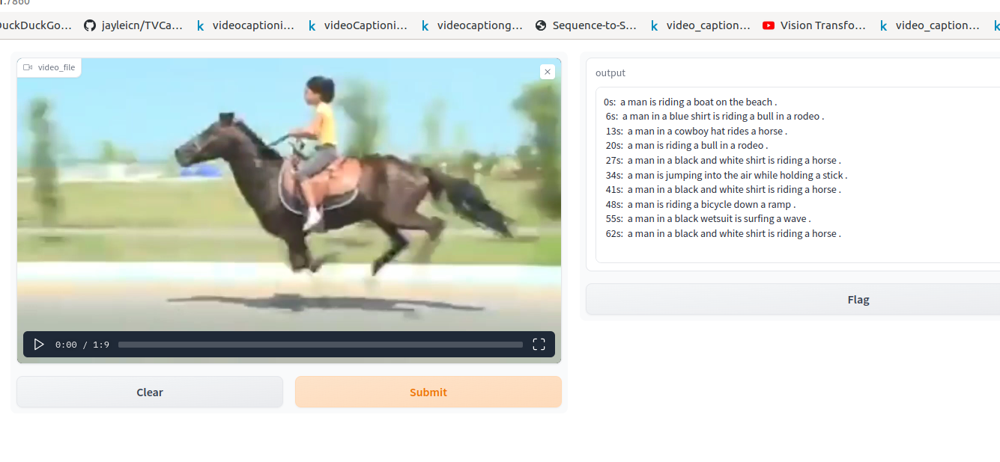

# for first time 
```
pipenv install
```

# for running after installation everytime
```
pipenv shell

cd app

pipenv run python3 imageCaptioning.py
```

if error try replacing python3 with python or just py it depends on your system

## Download our pretrained model from our gdrive 

```
Link: https://drive.google.com/file/d/1Pt0lBfFdiA0vgelDv-QwVO3gKJaANPZQ/view?usp=drive_link

```
 download the file move it to folder named model

 ### Results





